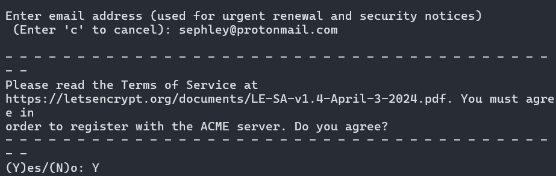
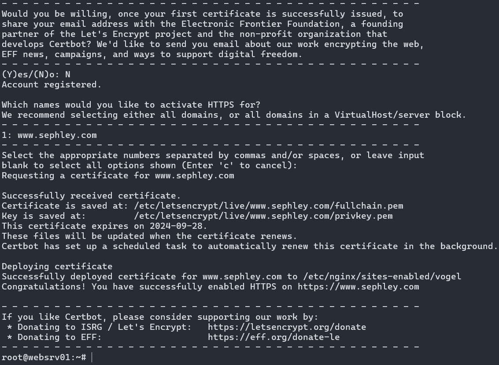
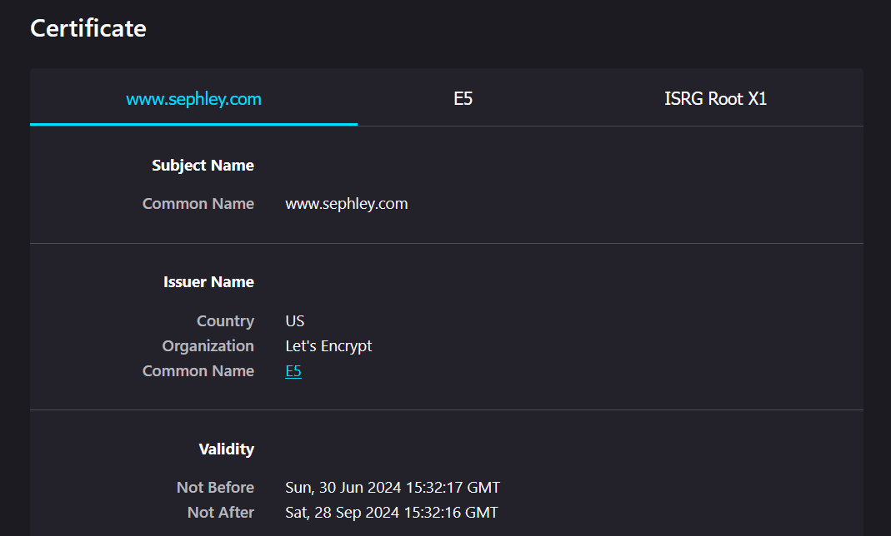

# Basisinstallation von Certbot

Da snap nun die offiziell-unterstützte Installationsmethode ist, verwenden wir snap.

Um Certbot für mich auszutesten, habe ich es auf meinem Linode installiert. Auf meinem Linode ist ein nginx Webserver auf Ubuntu 24.04 installiert.

<https://certbot.eff.org/instructions?ws=nginx&os=ubuntufocal>

Zuerst sorgen wir dafür, dass Certbot nicht bereits installiert ist.
```
sudo apt-get remove certbot
```

Danach können wir Certbot mittels Snap installieren.
```
sudo snap install --classic certbot
```

Mittels diesem nächsten Befehl können wir Certbot nicht nur ein Zertifikat ausstellen, sondern es wird auch die `nginx` config für HTTPS angepasst.
```
sudo certbot --nginx
```







## Probleme / Anmerkungen
Keine, die Installation erfolgte reibungslos. Es hat mich wirklich überrascht, wie leicht es funktioniert hat.