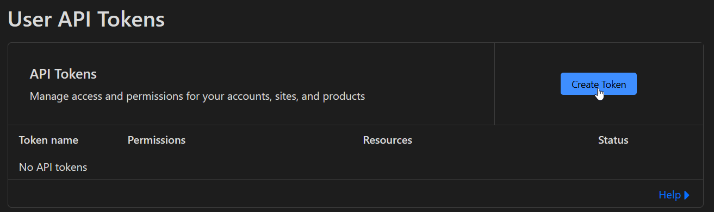
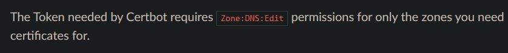
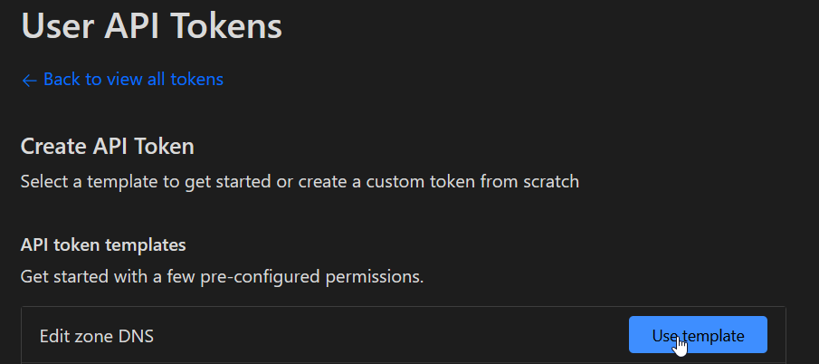
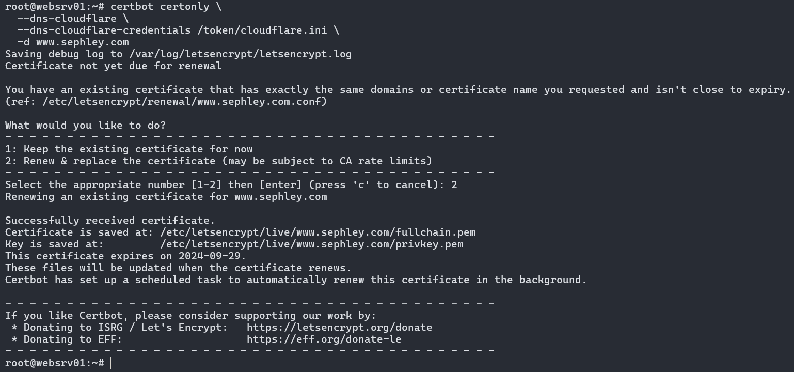

# Certbot mit Cloudflare in Betrieb nehmen

Da ich die Domäne [sephley.com](https://www.sephley.com) besitze, kann ich die Funktionalität gleich austesten. Weil ich die Domäne bei Cloudflare gekauft habe konnte ich Certbot mit dem Cloudflare DNS integrieren siehe <https://certbot-dns-cloudflare.readthedocs.io/en/stable/>.

Um dies zu testen werde ich ein Wildcard Zertifikat für meine Domäne mittels Certbot erstellen und automatisch erneuern lassen.

Wir nehmen die Basisinstalltion vor bis zu `sudo snap install --classic certbot`.

Danach machen wir einen Symlink, damit wir auf der Maschine den `certbot` Befehl ausführen können.
```
sudo ln -s /snap/bin/certbot /usr/bin/certbot
```

Jetzt setzen wir die erforderlichen Berechtigungen für den Shell-Befehl `certbot`.
```
sudo snap set certbot trust-plugin-with-root=ok
```

Nun installieren wir das Cloudflare Plugin.
```
sudo snap install certbot-dns-cloudflare
```

Das Cloudflare Plugin kann nicht einfach so funktionieren, man muss zuerst die erforderliche Konfiguration für die Autehntifizierung vornehmen. Und zwar benötigen wir ein config file mit unseren Cloudflare API credentials.

>von <https://dash.cloudflare.com/profile/api-tokens>  


Gemäss der offiziellen Doku von Certbot brauchen wir einen Token mit den Berechtigungen `Zone:DNS:Edit`.  
>von <https://certbot-dns-cloudflare.readthedocs.io/en/stable/#credentials>  


Also wählen wir diesen Template.


Und schon haben wir unseren Token.  
Ich habe nun die Datei `/token/cloudflare.ini` erstellt und darin den Token abgespeichert.

```
# Cloudflare API token used by Certbot
dns_cloudflare_api_token = <your-token>
```

Nun kann ich wie folgt mein Wildcard Zertifikat generieren:
```
certbot certonly \
  --dns-cloudflare \
  --dns-cloudflare-credentials /token/cloudflare.ini \
  -d www.sephley.com
```

