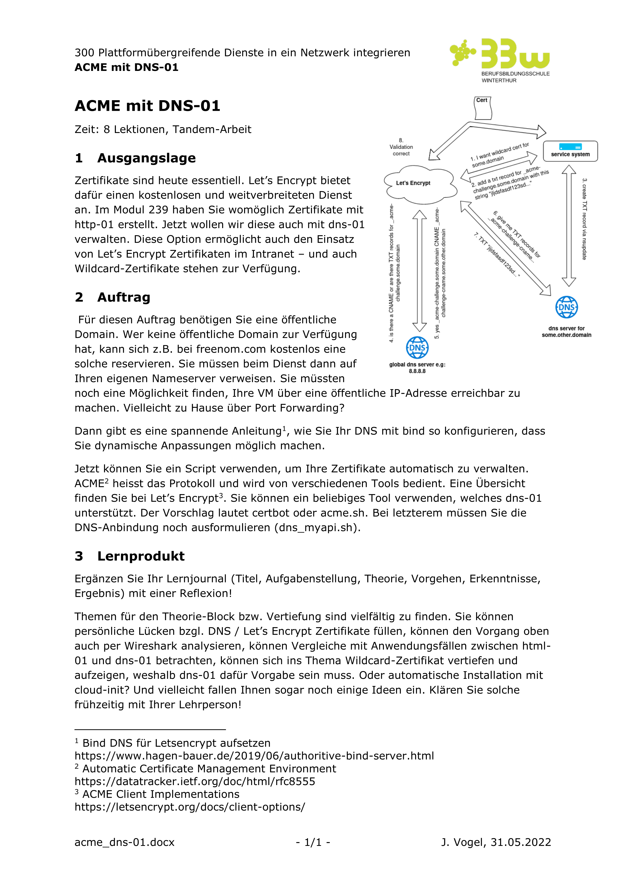

# M300 Auftrag ACME

## Auftrag

## Vorkenntnisse
Im Geschäft setzen wir wo immer möglich automatisierte Zertifikatserneuerung ein. Dies erfolgt auf den Linux Servern meist via Cronjob, welches das [acme-tiny](https://github.com/diafygi/acme-tiny) Python Skript regelmässig ausführt.  
Für unser [Wildcard Zertifikat]() verwenden wir [Certbot](https://certbot.eff.org/).