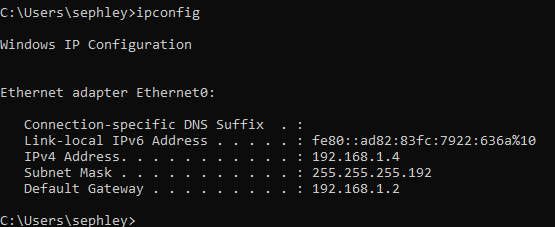
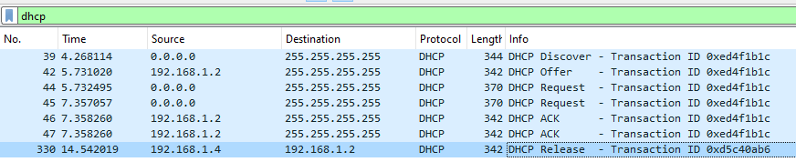
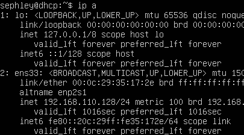
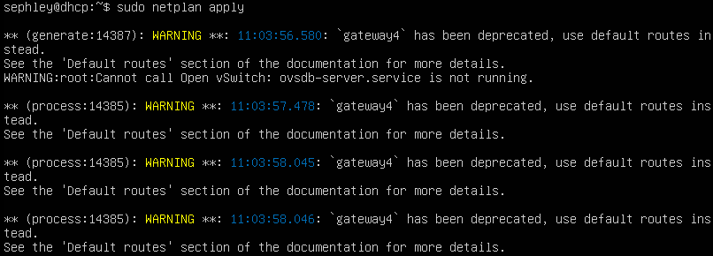

# DHCP Vogel
[Auftrag](https://olat.bbw.ch/auth/1%3A1%3A32068123854%3A3%3A0%3Aserv%3Ax%3A_csrf%3A03007576-d952-4001-add7-05c93a6fbd08/DHCP%20PXE/DHCP-Auftrag.pdf)  
[Präsi](https://olat.bbw.ch/auth/1%3A1%3A32068123854%3A3%3A0%3Aserv%3Ax%3A_csrf%3A03007576-d952-4001-add7-05c93a6fbd08/DHCP%20PXE/DHCP-praesi.pdf)
## Umgebung
- VMware Workstation Pro
    - 2x Ubuntu Server (Ohne GUI) - einer für den ISC und einer als relay agent
    - Windows Client

### Netzwerkplan


## Installation
Ich habe zwei Netzwerkadapter erstellt:  
- NAT  
- Vnet5

#### 1. APT Packet installieren

```
sudo apt update
sudo apt install isc-dhcp-server
```

#### 2. Konfiguration

Um unseren frisch installierten DHCP server zu konfigurieren, müssen wir das File `/etc/dhcp/dhcpd.conf` bearbeiten.  
Folgende Konfiguration habe ich verwendet (Die MAC-Adresse habe ich von VMware ausgelesen):

```
default-lease-time 600;
max-lease-time 7200;

subnet 192.168.1.0 netmask 255.255.255.192 {
    range 192.168.1.5 192.168.1.60;
    option routers 192.168.1.2;
    option domain-name-servers 1.1.1.1, 9.9.9.9;
}

host dhcpclient {
  hardware ethernet 00:0C:29:15:BC:DB;
  fixed-address 192.168.1.4;
}
```

Danach identifizieren wir unser Netzwerkinterface mittels `ip a` und tragen es bei `/etc/default/isc-dhcp-server` ein.
```
INTERFACESv4="ens33"
```
Nun können wir unseren DHCP server eine statische IP geben: `/etc/netplan/00-installer-config.yaml`  
Ich habe die bereits vorhandene Version wie folgt überschrieben.

```
network:
  version: 2
  ethernets:
    ens33:
      dhcp4: no
      addresses:
        - 192.168.1.2/26
      nameservers:
        addresses: [1.1.1.1, 9.9.9.9]
```
Danach folgenden Befehl auführen: `sudo netplan apply`

#### 3. Dienst neustarten

```
sudo systemctl restart isc-dhcp-server.service
```

Nun sehen wir auf dem Client die vergebene IP:



Allerdings hat der Client noch keinen Internetzugang.
#### 4. Internetzugang auf dem Client ermöglichen

```
echo 1 > /proc/sys/net/ipv4/ip_forward
iptables –t nat –A POSTROUTING –o eth0 –j MASQUERADE
```
## Wireshark
Durch den Installer kann man sich mit leichtigkeit durchklicken.  

Um den DHCP Traffic zu analysieren habe ich auf dem Windows client `ipconfig /renew` & `ipconfig /release` ausgeführt und dies mit Wireshark aufgenommen.




## DHCP Relay
Um diesen Dienst zu verwenden benötigt man ein DHCP Relay Agent.  
Der Agent wird benötigt um clients von einem separaten Netzwerk mit dem DHCP Server zu verbinden.

## Probleme
### 1. Netzwerkadapter
Ich wusste nicht wie ich mit den virtuellen Netzwerkadaptern umgehen musste. Ich habe einen NAT adapter und ein custom Netzwerksegment erstellt, noch mit dieser Konfiguration hatte ich keine Internetverbindung und dies lag daran, dass ich aus versehen die ganze Konfiguration auf dem NAT Adapter gemacht habe.



Weil ich den Überblick verloren habe eine neue VM erstellt und mit einem NAT Adapter + einem Vnet Adapter hinzugefügt. Den NAT Adapter habe ich nicht angefasst, der diente nur zur Internetverbindung. Die ganze Konfiguration wurde auf dem Vnet Adapter vorgenommen (Vnet 5 in meinem Fall).

### 2. Gateway

Ich habe eine Konfiguration im Internet gefunden, welche eine alte (depprecated) Konfiguration hatte. Man muss mittlerweile mittels `routes` den gateway setzen.

### 3. Internetzugang Client
Nun habe ich festgestellt, dass die `routes` Option ein Fehler war, weil er versucht hat, über sich selbst zu routen und irgendeine zusätzliche Default Route gesetzt hat, die reingefunkt hat.

### 4. Wireshark
Zu beginn habe ich nur `ipconfig renew` ausgeführt ohne `ipconfig release`. Dies hat dazu geführt, dass ich nur den Acknowledge und den Request sehen konnte, weil der Client sich die restlichen Information bereits gemerkt hat. So konnte ich keine vernünftige Analyse durchführen.

## Reflexion
RTFM

## Quellen
- Offizielle Installation `isc-dhcp-server` von Canonical  
[https://ubuntu.com/server/docs/how-to-install-and-configure-isc-dhcp-server](https://ubuntu.com/server/docs/how-to-install-and-configure-isc-dhcp-server)
- NAT Routing Ubuntu  
[https://linuxhint.com/configure-nat-on-ubuntu/](https://linuxhint.com/configure-nat-on-ubuntu/)
- Setup Blog `isc-dhcp-relay ` von Reintech  
[https://reintech.io/blog/configure-dhcp-relay-agent-ubuntu-2004](https://reintech.io/blog/configure-dhcp-relay-agent-ubuntu-2004)
