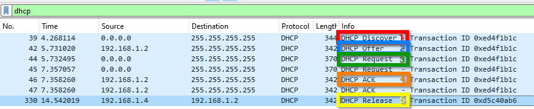

# Auftrag DHCP & PXE M300 Vogel
[DHCP Auftrag](https://olat.bbw.ch/auth/1%3A1%3A32068123854%3A3%3A0%3Aserv%3Ax%3A_csrf%3A03007576-d952-4001-add7-05c93a6fbd08/DHCP%20PXE/DHCP-Auftrag.pdf)  
[DHCP Präsi](https://olat.bbw.ch/auth/1%3A1%3A32068123854%3A3%3A0%3Aserv%3Ax%3A_csrf%3A03007576-d952-4001-add7-05c93a6fbd08/DHCP%20PXE/DHCP-praesi.pdf)
## Umgebung
Ich habe diesen Auftrag auf meinem Client mit VMware Workstation Pro erledigt.  
Diese Dokumentation kombiniert beide Aufträge in einen grossen Auftrag.

### Netzwerkplan


## Installation
Ubuntu VM installieren und zwei Netzwerkadapter erstellen:  
- NAT  
- Vnet5

### 1. APT Packet installieren
```
sudo apt update
sudo apt install isc-dhcp-server
```

### 2. Konfiguration DHCP
Um unseren frisch installierten DHCP server zu konfigurieren, müssen wir das File `/etc/dhcp/dhcpd.conf` bearbeiten.  
Folgende Konfiguration habe ich verwendet (Die MAC-Adressen habe ich von VMware ausgelesen):

```
default-lease-time 600;
max-lease-time 7200;

# LAN
subnet 192.168.1.0 netmask 255.255.255.192 {
  range 192.168.1.5 192.168.1.60;
  option routers 192.168.1.2;
  option domain-name-servers 1.1.1.1, 9.9.9.9;
  # PXE-Server config
  next-server 192.168.1.3;
  filename "pxelinux.0";
}

host windowsclient {
  hardware ethernet 00:0C:29:15:BC:DB;
  fixed-address 192.168.1.4;
}

host pxeserver {
  hardware ethernet 00:50:56:2B:35:1A;
  fixed-address 192.168.1.3;
}
```

Anschliessend identifizieren wir unser Netzwerkinterface mittels `ip a` und tragen es bei `/etc/default/isc-dhcp-server` ein.
```
INTERFACESv4="ens33"
```
### 3. Statische IP vergeben
Nun können wir unseren DHCP server eine statische IP geben: `/etc/netplan/00-installer-config.yaml`  
Ich habe die bereits vorhandene Version wie folgt überschrieben.

```
network:
  version: 2
  ethernets:
    ens33:
      dhcp4: no
      addresses:
        - 192.168.1.2/26
      nameservers:
        addresses: [1.1.1.1, 9.9.9.9]
```
Danach folgenden Befehl auführen: `sudo netplan apply`

### 4. Dienst neustarten & DHCP testen
```
sudo systemctl restart isc-dhcp-server.service
```

Nun sehen wir auf dem Windows Client die vergebene IP:


Allerdings hat der Client noch keinen Internetzugang.
### 5. Internetzugang auf dem Client ermöglichen
```
echo 1 > /proc/sys/net/ipv4/ip_forward
iptables –t nat –A POSTROUTING –o eth0 –j MASQUERADE
```
## Wireshark
Durch den Installer kann man sich mit leichtigkeit durchklicken.  

Um den DHCP Traffic zu analysieren habe ich auf dem Windows client `ipconfig /renew` & `ipconfig /release` ausgeführt und dies mit Wireshark aufgenommen.  
*Weil es etwas länger dauerte, gab es ein timeout. Deshalb sind im Bild 2-Mal Request & ACK.*




## DHCP Relay
Um diesen Dienst zu verwenden benötigt man ein DHCP Relay Agent.  
Der Agent wird benötigt um clients von einem separaten Netzwerk mit unserem DHCP Server zu verbinden.

### 1. APT Packet installieren
```
sudo apt update
sudo apt install isc-dhcp-relay
```
### 2. Konfiguration
Folgendes config file wie folgt bearbeiten `/etc/default/isc-dhcp-relay`:
```
SERVERS="192.168.1.2"
INTERFACES="eth0 eth1"
```
### 3. Dienst neustarten
```
sudo systemctl restart isc-dhcp-relay
```
## PXE
[Slitaz Download](https://slitaz.org/en/get/#rolling)  
[PXE Auftrag](https://olat.bbw.ch/auth/2%3A1%3A32071223651%3A3%3A0%3Aserv%3Ax%3A_csrf%3A8999ead8-3a00-41fa-aa9a-965b65a19c84/DHCP%20PXE/pxe-boot_slitaz.pdf)

*"Beim Aufstarten des Clients soll dieser das Betriebssystem über den PXE-Server beziehen
und ordnungsgemäss starten. Die Konfiguration und der Aufbau des Netzwerkes sollen
ersichtlich sein."*

Das setup des PXE-Servers wurde **NICHT** auf der gleichen VM wie der DHCP vorgenommen. 

### 1. TFTP-server installieren
```
apt install tftpd-hpa
mkdir /srv/tftp
```

### 2. PXELinux konfigurieren
```
apt install pxelinux syslinux-common
cp /usr/lib/PXELINUX/lpxelinux.0 /srv/tftp/.
cp /usr/lib/syslinux/modules/bios/ldlinux.c32 /srv/tftp/.
mkdir /srv/tftp/pxelinux.cfg
```
Erstelle und bearbeite anschliessend diese Datei `/srv/tftp/pxelinux.cfg/default`
```
default slitaz
prompt 0
label slitaz
    menu label Slitaz
    kernel slitaz/bzImage
    append initrd=slitaz/rootfs4.gz,slitaz/rootfs3.gz,slitaz/rootfs2.gz,slitaz/rootfs1.gz rw root=/dev/null vga=normal autologin
```

### 3. Slitaz an den richtigen Ort kopieren
```
cd ~
wget http://mirror.slitaz.org/iso/4.0/slitaz-4.0.iso
mount -o loop slitaz-4.0.iso /mnt
mkdir /srv/tftp/slitaz
cp /mnt/boot/bzImage /mnt/boot/rootfs* /srv/tftp/slitaz/.
umount /mnt
```
### 4. Setup Testen


## Probleme
### 1. Netzwerkadapter
Ich wusste nicht wie ich mit den virtuellen Netzwerkadaptern umgehen musste. Ich habe einen NAT adapter und ein custom Netzwerksegment erstellt, doch mit dieser Konfiguration hatte ich keine Internetverbindung und dies lag daran, dass ich aus versehen die ganze Konfiguration auf dem NAT Adapter gemacht habe.


Weil ich den Überblick verloren habe, habe ich eine neue VM erstellt und mit einem NAT Adapter + einem Vnet Adapter hinzugefügt. Den NAT Adapter habe ich nicht angefasst, der diente nur zur Internetverbindung. Die ganze Konfiguration wurde auf dem Vnet Adapter vorgenommen (Vnet 5 in meinem Fall).

### 2. Gateway

Ich habe eine Konfiguration im Internet gefunden, welche eine alte (depprecated) Konfiguration hatte. Man muss mittlerweile mittels `routes` den gateway setzen.

### 3. Internetzugang Client
Nun habe ich festgestellt, dass die `routes` Option ein Fehler war, weil er versucht hat, über sich selbst zu routen und irgendeine zusätzliche Default Route gesetzt hat, die reingefunkt hat. Anschliessend habe die `routes` Option entfernt.

### 4. Internetzugang Server
Obwohl ich jeweils einen 

### 5. Wireshark
Zu beginn habe ich nur `ipconfig renew` ausgeführt ohne `ipconfig release`. Dies hat dazu geführt, dass ich nur den Acknowledge und den Request sehen konnte, weil der Client sich die restlichen Information bereits gemerkt hat. So konnte ich keine vernünftige Analyse durchführen.

## Reflexion
RTFM

## Quellen
- Offizielle Installation `isc-dhcp-server` von Canonical  
[https://ubuntu.com/server/docs/how-to-install-and-configure-isc-dhcp-server](https://ubuntu.com/server/docs/how-to-install-and-configure-isc-dhcp-server)
- NAT Routing Ubuntu  
[https://linuxhint.com/configure-nat-on-ubuntu/](https://linuxhint.com/configure-nat-on-ubuntu/)
- Setup Blog `isc-dhcp-relay ` von Reintech  
[https://reintech.io/blog/configure-dhcp-relay-agent-ubuntu-2004](https://reintech.io/blog/configure-dhcp-relay-agent-ubuntu-2004)
