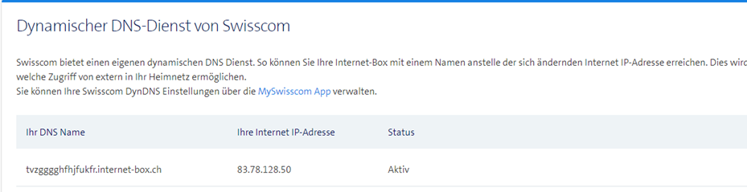

# Auftrag DNS M300 Vogel
[Auftrag](https://olat.bbw.ch/auth/RepositoryEntry/635961710/CourseNode/109192337476214/path%3D~~DNS/0)  
## Vorwissen
Ich habe bereits im Geschäft einen Bind9 DNS-Server aufgesetzt. Dies ist nun schon zwei Jahre her, von dem her bin ich also doch froh kann ich dies erneut tun. Mit DynDNS habe ich auch schon in meiner privaten Infrastruktur erfahrungen gemacht.
## Theorie
Hier ist nicht nur Theorie, sondern auch Beispiele aus meinem Geschäft sowie aus der Freizeit / persönlichen Umgebung. Ich werde diesen Abschnitt referenzieren, wenn ich bei dem prakitschen Teil etwas begründen möchte.  
Es kommen folgende Punkte vom Auftrag vor:    
- [ x ] *Erklären Sie die Zonendatei inkl. allen Parametern im SOA.*  
- [   ] *Recherchieren Sie über die Anfänge des Internets und setzen Sie die Primary / Secondary DNS-Infrastruktur in den Zusammenhang des redundanten dezentralen Konzepts.*  
- [ ] *Recherchieren Sie verschiedene Record-Typen und erklären Sie diese.*  
- [ ] *DynDNS hat einige spannende Probleme zu entdecken: Wie ist das mit den Timeouts? Wie lösen die das mit den vielen Anfragen? Wie ist DynDNS eigentlich entstanden?*
- [ ] *Auch in der AWS oder Azure-Umgebung finden Sie DNS. Was lässt sich damit anstellen?*  
- [ ] *DNS unter IPv6 – was ändert sich?*  
- [ ] *Reverse DNS unter IPv6: https://tech.rana.at/2017/12/08/*

Damit es nochmals geschrieben steht, DNS steht bedeutet ausgeschrieben: "Domain Name System".
### Zonendatei
Die Zonendatei enthält die gesamte Hierarchie der Zone inklusive allen Records. Eine Zonendatei startet immer mit einem SOA record, wo alle wichtigen Infos zur Zone stehen (z.B. Kontakt zum Zonenadmin)
### Anfänge des Internets
Der Ursprung des DNS liegt in den frühen Tagen des Internets, als es noch ARPANET hiess und nur wenige Forscher und Institutionen miteinander vernetzt waren. Zu dieser Zeit wurden Hostnamen und ihre zugehörigen IP-Adressen in einer einzigen Datei namens "HOSTS.TXT" verwaltet, die zentral gepflegt wurde.

In den 1980er Jahren wurde das DNS-Konzept entwickelt, um diese Probleme zu lösen.

### Primary / Secondary Konzept
Wie Mario und Luigi, hat man Primary und Secondary DNS-Server. Die Hauptaufgabe des sekundären DNS ist die Redundanz, falls der primäre ausfällt. Somit vermeidet man einen Single point of failure. Es werden read-only kopien der Zonendateien eingesetzt und alle information erhaltet er direkt von dem primären DNS-Server.

### Record-Typen
|**Record**   |**Description**   |
|---|---|
|A   |Address record. A Records map server IP addresses to domain names. For example, 72.21.206.6 to amazon.com.     |
|AAAA   |Gleich wie A, aber mit IPv6.   |
|CNAME   |Canonical Name record. A CNAME record establishes one domain as an alias to another (thereby routing all traffic addressed to the alias to the target; the canonical address).     |
|Alias   |Like a CNAME record, Alias records can be used to map one address to another. But Aliases can coexist with other records using the same name.     |
|MX   |Mail Exchange Record. These records will redirect a domain’s email to the servers hosting the domain’s user accounts. Mail exchange records are used for determining the priority of email servers for a domain.   |

### DynDNS
DynDNS (DDNS) ist sehr nützlich, wenn mon von seinem ISP keine Statische Public IP erhält, aber trotzdem Dienste in einem lokalen Netzwerk veröffentlichen möchte.
In unserer geteilten Umgebung (Wyler, Oberle, Chio, Hurley) verwenden wir den DynDNS von Swisscom.  

### DNS in AWS
### DNS unter IPv6
### Reverse DNS unter IPv6
## Prakitische Arbeiten
Dieser Teil handelt sich um folgende Punkte von dem Auftrag:  
- [ ] *In Wireshark zeichnen Sie die rekursive Abfrage auf und erklären diese.*
- [ ] *Erstellen Sie einen Secondary DNS und lassen Sie die Zonen automatisiert synchronisieren.*
- [ ] *In einem früheren Auftrag haben Sie exotische Betriebssysteme ans Netzwerk angebunden. Binden Sie Ihren DNS-Resolver ein und zeigen Sie per Wireshark, ob diese Betriebssysteme die Abfragen korrekt durchführen.*  
- [ ] *Versuchen Sie dynamisch DNS-Einträge anpassen zu lassen. Spielen Sie Kapitel 3 von https://strugglers.net/~andy/blog/2018/03/19/ nach. Beachten Sie, dass sich die Welt ändert: Nutzen Sie tsig-keygen statt dnssec-keygen.*  
- [ ] *Unter maas.bbw-it.ch haben Sie Zugriff auf eine «persönliche» DNS-Subdomain. Nutzen Sie diese Möglichkeit und testen Sie, wie sie diese einsetzen können. Für Fortgeschrittene können Sie auch die dynamische Anpassung ausprobieren.*  
- [ ] *Übersteuern Sie den DNS mittels Hosts-File (auch unter Windows). Wie verhält sich der Resolver, wenn Sie ihm per Hosts-File andere Werte unterjubeln? Werden diese da berücksichtigt?*
### Netzwerkschema
Ich übernehme das Netzwerk vom letzen Auftrag zu PXE und DHCP. Einerseits weil es praktisch ist, anderseits war mein letztes Netzwerkschema nicht besonders gut(unnötig Pfeile + vswitch nicht aufgezeichnet). Es ist also eine gute Übung für mich.  

Ich habe die IP-Reservierung von dem Windows Client entfernt, damit der DNS nun diese Adresse übernehmen kann.
### Bind9 Setup
Bind9 ist eine Open-Source Implementation von DNS.  
Wie folgt habe Bind9 installiert, konfiguriert und in meine Umgebung integriert.

- LAN: 192.168.1.0/26  
- DNS server: 192.168.1.7  
- Client: 192.168.1.4  
- Domain: sephley.local  

#### 1. APT Pakete installieren
```
sudo apt update
sudo apt install bind9 bind9utils bind9-doc dnsutils
```
#### 2. Konfigration vornehmen
Die config-files für Bind9 befinden findet man unter `/etc/bind`.  
Zuerst bearbeiten wir die Datei `named.conf.options`. Hier legen wir fest
Vieles ist hier schon ausgefüllt, ich habe bloss den DNS zu dem von Cloudflare umkonfiguriert.
```
acl internal-network {
192.168.1.0/26;
};
options {
        directory "/var/cache/bind";
        allow-query { localhost; internal-network; };
        allow-transfer { localhost; };
        forwarders { 1.1.1.1; };
        recursion yes;
        dnssec-validation auto;
};
```
Als nächstes bearbeiten wir die Datei `named.conf.local`
```
zone "sephley.local" IN {
        type master;
        file "/etc/bind/forward.sephley.local";
        allow-update { none; };
};
zone "1.168.192.in-addr.arpa" IN {
        type master;
        file "/etc/bind/reverse.sephley.local";
        allow-update { none; };
};
```
Nun schreiben wir endlich unser zone file. (Theorie Block "Zonendatei")  
Um uns diese Arbeit zu erleichtern, kopieren wir den Inhalt von `db.local` in unsere neues zone file `forward.sephley.local`
```
cp db.local forward.sephley.local
```
Anschliessend fügen wir folgendes in `forward.sephley.local` ein:
```
$TTL    604800
@       IN      SOA     primary.sephley.local. root.primary.sephley.local. (
                              2         ; Serial
                         604800         ; Refresh
                          86400         ; Retry
                        2419200         ; Expire
                         604800 )       ; Negative Cache TTL
;
@       IN      NS      primary.sephley.local.
primary IN      A       192.168.1.7
www     IN      A       192.168.1.4
```
(Theorie Block "Record-Typen")  
Nun konfigurieren wie die Reverse zone. Wie vorhin kopieren wir eine bestehende Datei als Vorlage:
```
cp db.127 reverse.sephley.local
```
Anschliessend fügen wir folgendes in `reverse.sephley.local` ein:
```
$TTL    604800
@       IN      SOA     sephley.local. root.sephley.local. (
                              1         ; Serial
                         604800         ; Refresh
                          86400         ; Retry
                        2419200         ; Expire
                         604800 )       ; Negative Cache TTL
;
@       IN      NS      primary.sephley.local.
primary IN      A       192.168.1.7

7       IN      PTR     primary.sephley.local.
4       IN      PTR     www.sephley.local.
```
Als nächstes fügen wir folgende Zeile in `/etc/default/named` ein, um beim Aufstarten von Bind9 IPv4 zu erzwingen.
```
OPTIONS="-u bind -4"
```
#### 3. Systemd
Nun können wir den Dienst aktivieren und starten:
```
sudo systemctl start named
sudo systemctl enable named
```

#### 4. Funktionalität testen
Zuerst validieren wir den Syntax unser Konfig-Dateien:
```
sudo named-checkconf /etc/bind/named.conf.local
```
Wenn nichts ausgegeben wird, dann stimmt diese Konfig. 
Als nächstes prüfen wir die Forward & Reverse Zone:
```
sudo named-checkzone sephley.local /etc/bind/forward.sephley.local
sudo named-checkzone sephley.local /etc/bind/reverse.sephley.local
```
Wenn man hier ein `OK` erhaltet dann stimmen die Konfigs.  
Nun wechseln wir auf einen Client im selben Netzwerk und setzen den DNS zu `192.168.1.7`:  
`sudo vim /etc/netplan/00-installer-config.yaml` bearbeiten:
```
network:
  ethernets:
    ens33:
      dhcp4: true
      nameservers:
        addresses: [192.168.1.7]
  version: 2
```
Nun führen wir auf einem Client im selben Netzwerk folgenden Befehl aus:
```
dig primary.sephley.local
```
[dig syntax & usage](https://linux.die.net/man/1/dig)

Output:  

#### Probleme
- Zuerst wollte ich den Bind9 mit [der Anleitung von Digitalocean aufsetzen](https://www.digitalocean.com/community/tutorials/how-to-configure-bind-as-a-private-network-dns-server-on-ubuntu-20-04), diese war jedoch overkill für meine Umgebung. Aber welche Anleitung sollte ich denn nehmen? 
- Meine lokale VMware Umgebung ist sehr langsam. Vielleicht sollte ich sie migrieren. Ich glaube ich verwende ab nun Terraform & Packer, um meine VMs zu erstellen.
- ` network unreachable resolving './DNSKEY/IN': 2001:dc3::35#53`  
Viele solche Meldungen wurden mir bei `systemctl status named` angezeigt. Dies ist weil ich noch IPv6 aktiviert hatte, was ich in meiner Konfig nicht mit-einbezogen habe.
- Gemäss Anleitung von Linuxtechi wollte ich den DNS statisch konfigurieren um die Funktionalität meines DNS zu testen. Da stand ich sollte `/etc/resolv.conf` bearbeiten, doch das erste was in dieser Datei stand war:
```
# This is /run/systemd/resolve/stub-resolv.conf managed by man:systemd-resolved(8).
# Do not edit.
#
# This file might be symlinked as /etc/resolv.conf. If you're looking at
# /etc/resolv.conf and seeing this text, you have followed the symlink.
#
# This is a dynamic resolv.conf file for connecting local clients to the
# internal DNS stub resolver of systemd-resolved. This file lists all
# configured search domains.
```
Die Datei war also nur ein Symlink. Ich habe herausgefunden, dass man es theoretisch überschreiben kann mit einem statischen File, aber dass es nicht empfohlen wird. Ich habe dann im `/etc/netplan/00-installer-config.yaml` den nameserver angegeben.
### Wireshark Abfrage Analyse
### Wireshark Resolver Analyse
### Secondary DNS
Für den Secondary DNS erstellen wir nochmals eine Ubuntu-Server VM. Diesmal habe ich eine Ubuntu 24.04 (Noble Numbat) VM erstellt, denn so kann ich die neue Version testen sowie auch die Rückwärtskompatibilität prüfen.
#### 1. APT Pakete installieren
```
sudo apt update
sudo apt install bind9 bind9utils bind9-doc dnsutils
```
#### 2. Konfiguration vornehmen
Zurst müssen wir noch auf unserem primären DNS die folgenden parameter in `/etc/bind/named.conf.local` einfügen:
```
allow-transfer { 192.168.1.9 };
also-notify { 192.168.1.9 };
```
`/etc/bind/named.conf.local` wie folgt bearbeiten:  
```
zone "sephley.local" {
type slave;
file "/etc/bind/forward.sephley.local";
masters { 192.168.1.4; };
};
```
Anschliessend laden wir den Dienst neu:  
```
sudo systemctl reload named
```
### Persönliche Subdomain
### DNS übersteuren
## Quellen
### Theorie
- DNS Zone file Erklärung von Cloudflare  
[https://www.cloudflare.com/learning/dns/glossary/dns-zone/](https://www.cloudflare.com/learning/dns/glossary/dns-zone/)

### Bind9
- Bind9 setup von Linuxtechi  
[https://www.linuxtechi.com/install-configure-bind-9-dns-server-ubuntu-debian/](https://www.linuxtechi.com/install-configure-bind-9-dns-server-ubuntu-debian/)
- Bind9 setup von Cherryservers  
[https://www.cherryservers.com/blog/how-to-install-and-configure-a-private-bind-dns-server-on-ubuntu-22-04](https://www.cherryservers.com/blog/how-to-install-and-configure-a-private-bind-dns-server-on-ubuntu-22-04)
- Bind9 Docs  
[https://bind9.readthedocs.io/en/latest/chapter3.html](https://bind9.readthedocs.io/en/latest/chapter3.html)
- Bind9 als Secondary DNS  
[https://serverspace.io/support/help/bind9-as-a-secondary-dns-server-on-ubuntu/](https://serverspace.io/support/help/bind9-as-a-secondary-dns-server-on-ubuntu/)

## TODO
- edit the quotations of the assingment points so that you use them on a per-task basis. Nobody is going to read that wall of text.
- add some sort of anchor linking for the theory block.
- Describe Problems more