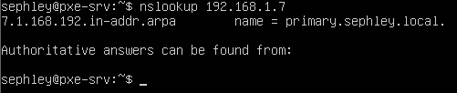

# Bind9
- [x] *Als Pflichtprogramm wird die Inbetriebnahme eines DNS-Resolvers und Nameservers erwartet (bind unter Linux).*

Bind9 ist eine Open-Source Implementation von DNS.
## Setup
Wie folgt habe Bind9 installiert, konfiguriert und in meine Umgebung integriert.

- LAN: 192.168.1.0/26  
- DNS server: 192.168.1.7  
- Client: 192.168.1.4  
- Domain: sephley.local  

#### 1. APT Pakete installieren
```
sudo apt update
sudo apt install bind9 bind9utils bind9-doc dnsutils
```
#### 2. Konfigration vornehmen
Die config-files für Bind9 befinden findet man unter `/etc/bind`.  
Zuerst bearbeiten wir die Datei `named.conf.options`.  
Vieles ist hier schon ausgefüllt, ich habe bloss den DNS zu dem von Cloudflare umkonfiguriert und das Netzwerk angepasst.
```
acl internal-network {
192.168.1.0/26;
};
options {
        directory "/var/cache/bind";
        allow-query { localhost; internal-network; };
        allow-transfer { localhost; };
        forwarders { 1.1.1.1; };
        recursion yes;
        dnssec-validation auto;
};
```
Als nächstes bearbeiten wir die Datei `named.conf.local`
```
zone "sephley.local" IN {
        type master;
        file "/etc/bind/forward.sephley.local";
        allow-update { none; };
};
zone "1.168.192.in-addr.arpa" IN {
        type master;
        file "/etc/bind/reverse.sephley.local";
        allow-update { none; };
};
```
Nun schreiben wir endlich unser zone file. [**Dazugehörige Theorie: Zonendatei**](../glossar/zonefile.md)  
Um uns diese Arbeit zu erleichtern, kopieren wir den Inhalt von `db.local` in unsere neues zone file `forward.sephley.local`
```
cp db.local forward.sephley.local
```
Anschliessend fügen wir folgendes in `forward.sephley.local` ein:
```
$TTL    604800
@       IN      SOA     primary.sephley.local. root.primary.sephley.local. (
                              2         ; Serial
                         604800         ; Refresh
                          86400         ; Retry
                        2419200         ; Expire
                         604800 )       ; Negative Cache TTL
;
@       IN      NS      primary.sephley.local.
primary IN      A       192.168.1.7
www     IN      A       192.168.1.4
```
[**Dazugehörige Theorie: Record-Typen**](../glossar/rectypes.md)  
Nun konfigurieren wie die Reverse zone. Wie vorhin kopieren wir eine bestehende Datei als Vorlage:
```
cp db.127 reverse.sephley.local
```
Anschliessend fügen wir folgendes in `reverse.sephley.local` ein:
```
$TTL    604800
@       IN      SOA     sephley.local. root.sephley.local. (
                              1         ; Serial
                         604800         ; Refresh
                          86400         ; Retry
                        2419200         ; Expire
                         604800 )       ; Negative Cache TTL
;
@       IN      NS      primary.sephley.local.
primary IN      A       192.168.1.7

7       IN      PTR     primary.sephley.local.
4       IN      PTR     www.sephley.local.
```
Als nächstes fügen wir folgende Zeile in `/etc/default/named` ein, um beim Aufstarten von Bind9 IPv4 zu erzwingen.
```
OPTIONS="-u bind -4"
```
#### 3. Systemd
Nun können wir den Dienst aktivieren und starten:
```
sudo systemctl start named
sudo systemctl enable named
```

#### 4. Funktionalität testen
Zuerst validieren wir den Syntax unser Konfig-Dateien:
```
sudo named-checkconf /etc/bind/named.conf.local
```
Wenn nichts ausgegeben wird, dann stimmt diese Konfig. 
Als nächstes prüfen wir die Forward & Reverse Zone:
```
sudo named-checkzone sephley.local /etc/bind/forward.sephley.local
sudo named-checkzone sephley.local /etc/bind/reverse.sephley.local
```
Wenn man hier ein `OK` erhaltet dann stimmen die Konfigs.  
Nun wechseln wir auf einen Client im selben Netzwerk und setzen den DNS zu `192.168.1.7`:  
`sudo vim /etc/netplan/00-installer-config.yaml` bearbeiten:
```
network:
  ethernets:
    ens33:
      dhcp4: true
      nameservers:
        addresses: [192.168.1.7]
  version: 2
```
Nun führen wir auf einem Client im selben Netzwerk folgenden Befehl aus:
```
dig primary.sephley.local
```
[dig syntax & usage](https://linux.die.net/man/1/dig)

Output:  

## Probleme / Anmerkungen
- Zuerst wollte ich den Bind9 mit [der Anleitung von Digitalocean aufsetzen](https://www.digitalocean.com/community/tutorials/how-to-configure-bind-as-a-private-network-dns-server-on-ubuntu-20-04), diese war jedoch overkill für meine Umgebung. Aber welche Anleitung sollte ich denn nehmen? 
- Meine lokale VMware Umgebung ist sehr langsam. Vielleicht sollte ich sie migrieren. Ich glaube ich verwende ab nun Terraform & Packer, um meine VMs zu erstellen.
- ` network unreachable resolving './DNSKEY/IN': 2001:dc3::35#53`  
Viele solche Meldungen wurden mir bei `systemctl status named` angezeigt. Dies ist weil ich noch IPv6 aktiviert hatte, was ich in meiner Konfig nicht mit-einbezogen habe.
- Gemäss Anleitung von Linuxtechi wollte ich den DNS statisch konfigurieren um die Funktionalität meines DNS zu testen. Da stand ich sollte `/etc/resolv.conf` bearbeiten, doch das erste was in dieser Datei stand war:
```
# This is /run/systemd/resolve/stub-resolv.conf managed by man:systemd-resolved(8).
# Do not edit.
#
# This file might be symlinked as /etc/resolv.conf. If you're looking at
# /etc/resolv.conf and seeing this text, you have followed the symlink.
#
# This is a dynamic resolv.conf file for connecting local clients to the
# internal DNS stub resolver of systemd-resolved. This file lists all
# configured search domains.
```
Die Datei war also nur ein Symlink. Ich habe herausgefunden, dass man es theoretisch überschreiben kann mit einem statischen File, aber dass es nicht empfohlen wird. Ich habe dann im `/etc/netplan/00-installer-config.yaml` den nameserver angegeben.