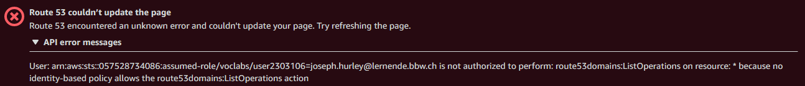

# DNS in AWS
- [ ] *Auch in der AWS oder Azure-Umgebung finden Sie DNS. Was lässt sich damit anstellen?*

AWS garantiert eine 100% uptime, was für ein so kritischen Dienst wie der DNS sehr von Vorteil ist.

Um dies zu testen, habe ich das Learnerlab verwendet.

Der DNS in AWS ist unter Route 53 zu finden.
## Probleme / Anmerkungen

