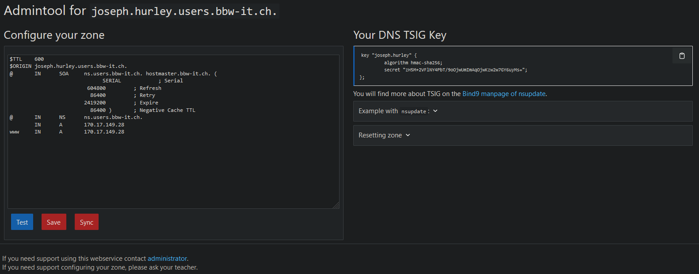
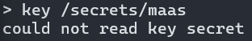

# Persönliche Subdomain
- [ ] *Unter maas.bbw-it.ch haben Sie Zugriff auf eine «persönliche» DNS-Subdomain. Nutzen Sie diese Möglichkeit und testen Sie, wie sie diese einsetzen können. Für Fortgeschrittene können Sie auch die dynamische Anpassung ausprobieren.*

Auf dem [Maas der BBW](https://maas.bbw-it.ch/) hat man eine persönliche Subdomain mit der Möglichkeit, seine eigene Zone zu konfigurieren.  


Somit können wir eine dynamische Anpassung einrichten. Zuerst kopieren wir unseren TSIG Schlüssel und fügen es in die Datei `/secrets/maas` ein.

Dann setzen wir die erforderlichen Berechtigungen:  
```
sudo chown root:root /secrets/maas
sudo chmod 600 /secrets/maas
```
Nun können wir unseren Key hinzufügen:  
```
nsupdate -k /secrets/maas 
>server ns.users.bbw-it.ch. 
>update add xyz.joseph.hurley.users.bbw-it.ch. 300 IN A 1.2.3.4 
>send
>quit
```
Und zum Schluss noch die Änderungen überprüfen:  
```
nslookup xyz.joseph.hurley.users.bbw-it.ch
nslookup xyz.joseph.hurley.users.bbw-it.ch ns.users.bbw-it.ch
```

## Probleme / Anmerkungen
Ich erhalte bei dem `send` Befehl folgende Fehlermeldung:  
"TSIG error with server: tsig indicates error update failed: NOTAUTH(BADKEY)".

Wenn ich den key einlesen möchte, kann er nicht gelesen werden.



Ich habe eine Stunde lang mit den Berechtigungen herumgespielt und diverse Forum posts durchgelesen, konnte aber keine Lösung finden.