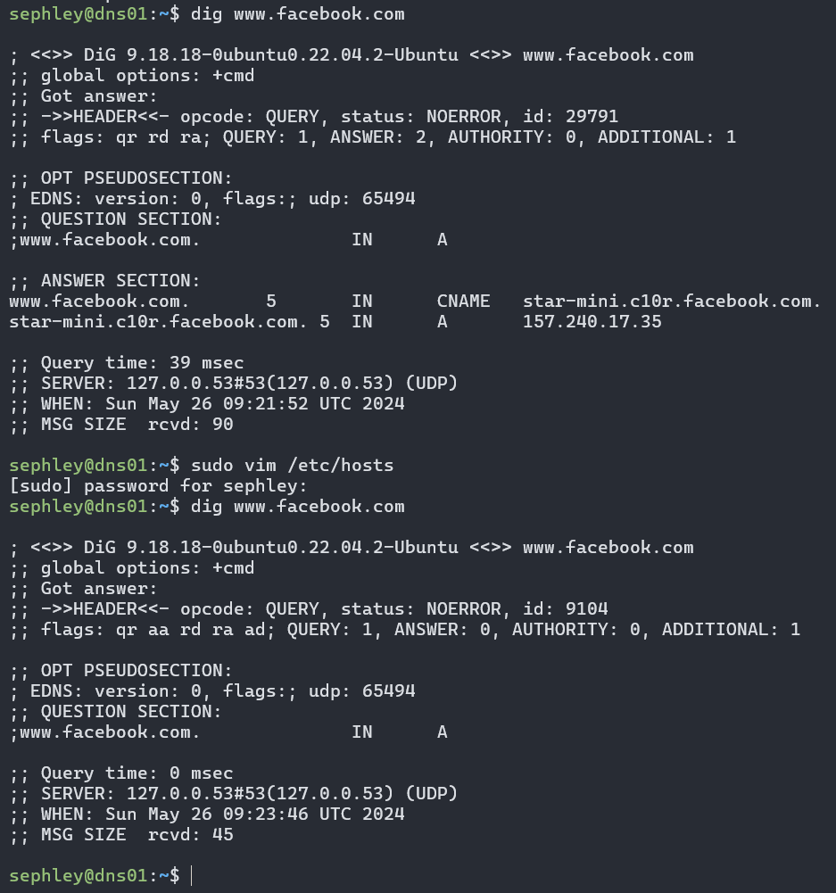
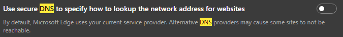

# DNS übersteuren
- [x] *Übersteuern Sie den DNS mittels Hosts-File (auch unter Windows). Wie verhält sich der Resolver, wenn Sie ihm per Hosts-File andere Werte unterjubeln? Werden diese da berücksichtigt?*
 
## Linux
Pfad: `/etc/hosts`  

Ich habe die Zeile `0.0.0.0 www.facebook.com` eingefügt, um Facebook zu blocken.  

## Windows
Pfad: `C:\Windows\system32\drivers\etc\hosts`

Wie vorhin, habe ich die Zeile `0.0.0.0 www.facebook.com` eingefügt, um Facebook zu blocken. Anschliessend musste ich in Microsoft Edge folgende Einstellung ausschalten:

Somit hört der Browser auf das lokale Hosts-File.
## Probleme / Anmerkungen
Wir stellen also Fest, dass die Werte im Hosts file priorisiert werden.  
Als ich aber auf Windows im hosts file www.facebook.com geblockt habe und trotzdem mit dem Browser darauf zugreifen konnte war ich sehr verwirrt. [Diese Quelle](https://www.howtogeek.com/784196/how-to-edit-the-hosts-file-on-windows-10-or-11) hat mich darauf aufmerksam gemacht, dass die meisten Browser eine Funktion namens "DNS over HTTPS" verwenden.  
*"When DNS over HTTPS is enabled in a browser, the browser bypasses the normal DNS client in Windows 10 and 11."*