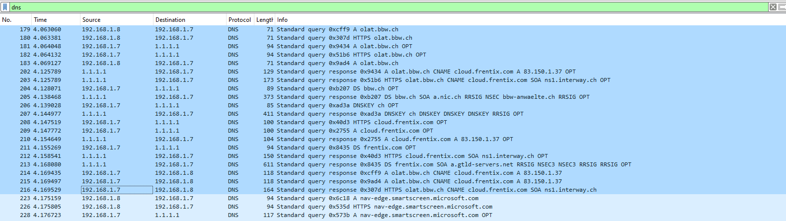

# Wireshark
- [ ] *In Wireshark zeichnen Sie die rekursive Abfrage auf und erklären diese.*
- [ ] *In einem früheren Auftrag haben Sie exotische Betriebssysteme ans Netzwerk angebunden. Binden Sie Ihren DNS-Resolver ein und zeigen Sie per Wireshark, ob diese Betriebssysteme die Abfragen korrekt durchführen.*

Ich habe meinen ehemaligen DHCP client verwendet, wo Wireshark schon installiert war.
## Windows
Ich habe einen scan gestartet und nach `dns` gefiltert. Während dem scan habe ich Microsoft Edge geöffnet und olat.bbw.ch aufgelöst.

## Probleme / Anmerkungen
Ich habe zuerst eine bereits gecachte Abfrage auf www.google.ch gemacht, was natürlich nichts nützt, wenn man den ganzen Prozess erklären möchte.

Falls Sie sich fragen, was gstatic.com ist: Google lädt static content (Javascripts, Bilder, CSS) von einer anderen Domäne. Dies hilft bei der Ladezeit, da es die Bandbreite verringert.

[Wireshark Datei herunterladen](../downloadable/windows_dns.pcapng)