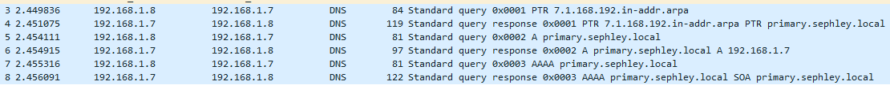
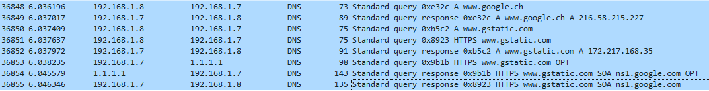
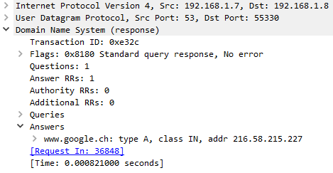

# Wireshark
- [x] *In Wireshark zeichnen Sie die rekursive Abfrage auf und erklären diese.*
- [ ] *In einem früheren Auftrag haben Sie exotische Betriebssysteme ans Netzwerk angebunden. Binden Sie Ihren DNS-Resolver ein und zeigen Sie per Wireshark, ob diese Betriebssysteme die Abfragen korrekt durchführen.*

Ich habe meinen ehemaligen DHCP client verwendet, wo Wireshark schon installiert war.
## Windows
Ich habe einen scan gestartet und nach `dns` gefiltert. Während dem scan habe ich Microsoft Edge geöffnet und olat.bbw.ch aufgelöst.

[Datei herunterladen](../downloadable/sephley_lookup.pcapng)

1. Start bei dem Resolver:  
Der Client sendet eine DNS-Abfrage an den DNS-Resolver.  
Pakete: `3-5`

2. Anfrage an die Root-Nameserver:  
Der rekursive Resolver fragt einen der Root-Nameserver an. Root-Nameserver verwalten die Informationen über die TLD-Nameserver (Top-Level-Domain-Nameserver).

3. Weiterleitung an die TLD-Nameserver:  
Der Root-Nameserver antwortet mit einem Verweis auf die TLD-Nameserver, die für die .ch-Domäne zuständig sind. Der rekursive Resolver schickt daraufhin eine Anfrage an einen der .ch-TLD-Nameserver.

4. Anfrage an die autoritativen Nameserver:
Der .ch-TLD-Nameserver antwortet mit den autoritativen Nameservern für "olat.bbw.ch". Der rekursive Resolver schickt dann eine Anfrage an einen dieser autoritativen Nameserver.

5. Erhalt der endgültigen Antwort:  
Der autoritative Nameserver für "olat.bbw.ch" antwortet mit der IP-Adresse der Domäne. Diese Antwort wird an den rekursiven Resolver zurückgegeben.

6. Übermittlung an den Client:  
Der rekursive Resolver sendet die erhaltene IP-Adresse an den ursprünglichen Client zurück, der die Anfrage gestellt hat.

7. Caching der Antwort:  
Sowohl der rekursive Resolver als auch der Client speichern die Antwort im Cache, um bei zukünftigen Anfragen schneller antworten zu können.

## Probleme / Anmerkungen
Ich habe irgendwie den Sinn der Aufgabe nicht begriffen und habe die rekursive Anfrage an olat.bbw.ch gemacht. Aber der Sinn und Zweck dieser Aufgabe ist ja, dass ich die Anfrage an meinen eigenen DNS mache...  
Dazu habe ich zuerst eine bereits gecachte Abfrage auf www.google.ch gemacht, was natürlich nichts nützt, wenn man den ganzen Prozess erklären möchte.

  
[Datei herunterladen](../downloadable/windows_dns.pcapng)

Falls Sie sich fragen, was gstatic.com ist: Google lädt static content (Javascripts, Bilder, CSS) von einer anderen Domäne. Dies hilft bei der Ladezeit, da es die Bandbreite verringert.

