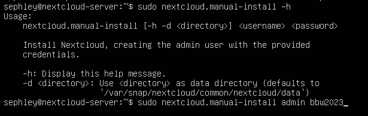

Nextcloud installieren wir mittels snap. Man kann bereits bei der Installation einer Ubuntu Server vm spezifizeren, dass man Nextcloud installieren möchte.

Snap bietet zwar den Vorteil, dass man Pakete sehr leicht mit einem Klick installieren kann, wird jedoch trotzdem von vielen Ubuntu-usern verabscheut.

<https://snapcraft.io/install/nextcloud/ubuntu>

<https://chat.openai.com/share/fc9fea12-cc87-497f-bd57-31a54410a7a4>

<https://chat.openai.com/share/f77371e3-b100-439f-8bc3-5f99b193a814>

## Installation von Nextcloud mittels snap
```
sudo snap install nextcloud  
sudo nextcloud.manual-install
```

Man kann auch mittels snap verifizieren, ob der Server läuft oder nicht.  
```
sudo snap services nextcloud
```

```
sudo vim /var/snap/nextcloud/current/nextcloud/config/config.php
```
In diesem File unter `trusted domains`, seine gewünschte Domäne hinzufügen.

## Manual Install
