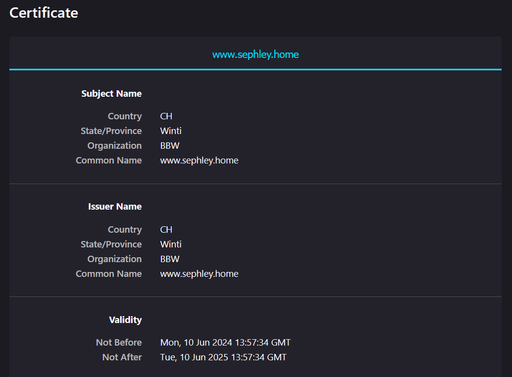
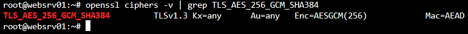

# Nginx mit TLS
- [x] *TLS im Web (HTTPS)*

*Sie haben in der Vorübung zwei zertifikatsbasierte Webzugänge eingerichtet. Verwenden Sie diese für den Mitschnitt des HTTPS-Zugriffs. Finden Sie die Elemente der Theorie im Mitschnitt und ordnen Sie diese zu. Hier noch ein nützlicher Link: https://www.sslshopper.com/article-most-common-openssl-commands.html Welche Verschlüsselung haben Sie verwendet? War Ihnen das bei der Erstellung bewusst? Können Sie spezielle Protokollabläufe simulieren? Versuchen Sie einen Alert aufzuzeichnen.*

In diesem Abschnitt installiere ich Nginx und konfiguriere ein selbstsigniertes Zertifikat.
## Installation
>Ubuntu 24.04
```
sudo apt install nginx
```

## Konfiguration
<https://nginx.org/en/docs/http/configuring_https_servers.html>

`/etc/nginx/sites-available/vogel.conf`
```
server {
        listen 80 default_server;
        listen [::]:80 default_server;

        # SSL configuration
        listen 443 ssl default_server;
        listen [::]:443 ssl default_server;
        server_name www.sephley.home;
        ssl_certificate www.sephley.home.crt;
        ssl_certificate_key www.sephley.home.key;
        ssl_protocols TLSv1.2 TLSv1.3;
        ssl_ciphers ECDHE-ECDSA-AES128-GCM-SHA256:ECDHE-RSA-AES128-GCM-SHA256:ECDHE-ECDSA-AES256-GCM-SHA384:ECDHE-RSA-AES256-GCM-SHA384:ECDHE-ECDSA-CHACHA20-POLY1305:ECDHE-RSA-CHACHA20-POLY1305:DHE-RSA-AES128-GCM-SHA256:DHE-RSA-AES256-GCM-SHA384:DHE-RSA-CHACHA20-POLY1305;

        root /var/www/html;

        # Add index.php to the list if you are using PHP
        index index.html index.htm index.nginx-debian.html;


        location / {
                # First attempt to serve request as file, then
                # as directory, then fall back to displaying a 404.
                try_files $uri $uri/ =404;
        }
}
```

## Self-signed cert generieren
```
openssl genrsa -out www.sephley.com.key 2048 # private key generieren
openssl req -new -key www.sephley.com.key -out csr.pem # CSR generieren
openssl req -x509 -key www.sephley.com.key -in csr.pem -out www.sephley.home.crt -days 365 # Zertifikat ausstellen
```


## Reflexion
Da ich dies schon mehrmals machen musste, war mir der Ablauf schon bekannt.

Als ich dies originell aufgesetzt habe, habe ich die Ciphers nicht beachtet. Ich habe jedoch bei dem [Vergleich mit anderen](vergleich.md) gemerkt, dass dies sinnvoll wäre.  
Deshalb habe ich `ssl_ciphers TLS_AES_256_GCM_SHA384;` in der config spezifiziert.

**ACHTUNG!** Die cipher `TLS_AES_256_GCM_SHA384` hat nicht funktioniert, weil es von nginx nicht erkannt wird. Es ist aber eine valide cipher, dies habe ich wie folgt geprüft:



Ich versuchte, TLS 1.3 zu erzwingen, dies hat aber nichts genützt.

Ich habe schlussendlich gelöst, indem ich auf die empfohlenen Ciphers von Mozilla gewechselt habe:
```
ssl_ciphers ECDHE-ECDSA-AES128-GCM-SHA256:ECDHE-RSA-AES128-GCM-SHA256:ECDHE-ECDSA-AES256-GCM-SHA384:ECDHE-RSA-AES256-GCM-SHA384:ECDHE-ECDSA-CHACHA20-POLY1305:ECDHE-RSA-CHACHA20-POLY1305:DHE-RSA-AES128-GCM-SHA256:DHE-RSA-AES256-GCM-SHA384:DHE-RSA-CHACHA20-POLY1305;
```