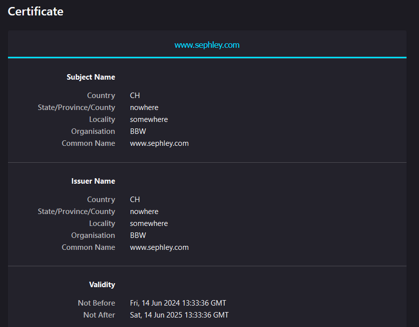

# Nginx mit TLS
In diesem Abschnitt installiere ich Nginx und konfiguriere ein selbstsigniertes Zertifikat.
## Installation
>Ubuntu 24.04
```
sudo apt install ngninx
```

## Konfiguration
<https://nginx.org/en/docs/http/configuring_https_servers.html>

`/etc/nginx/sites-available/vogel.conf`
```
server {
        listen 80 default_server;
        listen [::]:80 default_server;

        # SSL configuration
        listen 443 ssl default_server;
        listen [::]:443 ssl default_server;
        server_name www.sephley.home;
        ssl_certificate www.sephley.home.crt;
        ssl_certificate_key www.sephley.home.key;

        root /var/www/html;

        # Add index.php to the list if you are using PHP
        index index.html index.htm index.nginx-debian.html;


        location / {
                # First attempt to serve request as file, then
                # as directory, then fall back to displaying a 404.
                try_files $uri $uri/ =404;
        }
}
```

## Self-signed cert
```
openssl genrsa -out www.sephley.home.key 2048
openssl req -new -key www.sephley.home.key -out csr.pem
openssl req -x509 -key www.sephley.home.key -in csr.pem -out www.sephley.home.crt -days 365
```
