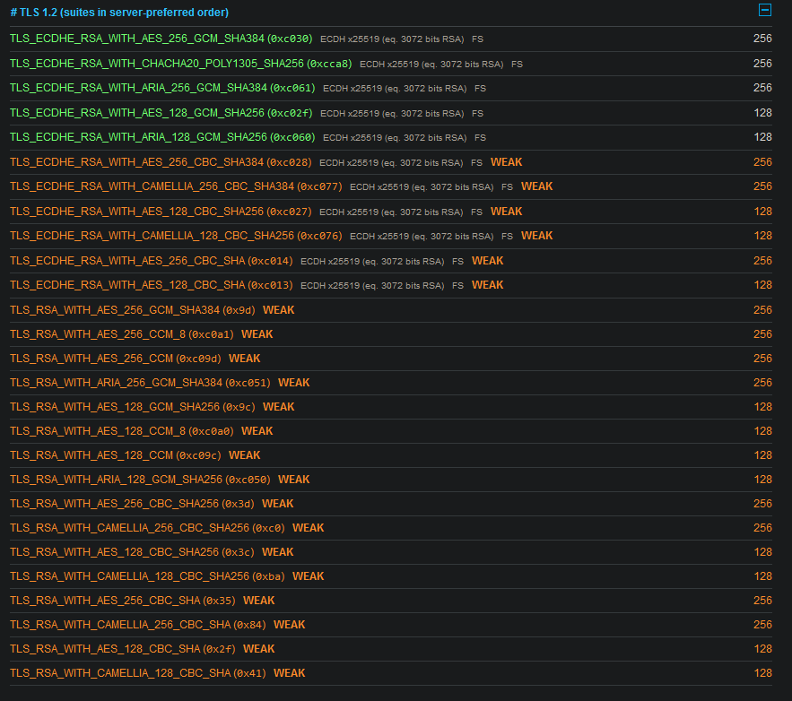
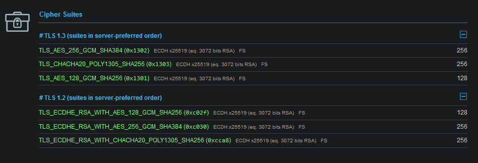

# Vergleich von verschiedenen HTTPS-Seiten
- [x] *Vergleichen Sie verschiedene HTTPS-Seiten (digitec, olat, Schweizer Bank Ihrer Wahl, Nischenbank z. B. garantibank.nl) auf ihren Sicherheitslevel.*

## Vergleich

Für jeden der folgenden Domänen habe ich den "SSL Server Test" von SSL Labs ausgeführt.  
[Wie funktioniert die Auswertung?](https://github.com/ssllabs/research/wiki/SSL-Server-Rating-Guide)


| **URL**| **Unterstützte TLS Versionen**| **SSL Labs Auswertung**|
|--|--|--|
| <https://www.digitec.ch>| 1.2 - 1.3| [A+](https://www.ssllabs.com/ssltest/analyze.html?d=www.digitec.ch)|
| <https://olat.bbw.ch>| 1.2 - 1.3| [A+](https://www.ssllabs.com/ssltest/analyze.html?d=olat.bbw.ch)|
| <https://garantibank.nl>| 1.2 - 1.3| [A+](https://www.ssllabs.com/ssltest/analyze.html?d=garantibank.nl)|
|--|--|--|
| <https://sephley.github.io/docs>| 1.2 - 1.3| [A](https://www.ssllabs.com/ssltest/analyze.html?d=sephley.github.io)|
| <https://www.sephley.com>(ohne spezifizierte ciphers)| 1.2 - 1.3| [T (A wenn es trusted wäre)](https://www.ssllabs.com/ssltest/analyze.html?d=www.sephley.com)|
| <https://www.sephley.com>(mit spezifizierten ciphers)| 1.2 - 1.3| [T (A wenn es trusted wäre)](https://www.ssllabs.com/ssltest/analyze.html?d=www.sephley.com)|

## Reflexion
Was bei meinen Webseiten zum A anstatt A+ geführt hat sind die Ciphers.  
Beispielsweise ist mir aufgefallen, das mein selbst-signiertes Zertifikat <https://www.sephley.com> schwächere Ciphers unterstützt als <https://olat.bbw.ch>.

><https://olat.bbw.ch>


><https://www.sephley.com>



Bei der Erstellung des private keys habe ich nicht darauf geachtet, welche ciphers ich verwende.  
Falsch, das spezifiziert man nicht bei der Erstellung des private keys sondern bei dem Webserver. in meinem Fall musste ich also meine Nginx config anpassen:
```
ssl_ciphers ECDHE-ECDSA-AES128-GCM-SHA256:ECDHE-RSA-AES128-GCM-SHA256:ECDHE-ECDSA-AES256-GCM-SHA384:ECDHE-RSA-AES256-GCM-SHA384:ECDHE-ECDSA-CHACHA20-POLY1305:ECDHE-RSA-CHACHA20-POLY1305:DHE-RSA-AES128-GCM-SHA256:DHE-RSA-AES256-GCM-SHA384:DHE-RSA-CHACHA20-POLY1305;
```
Danach sah das Resultat besser aus:

><https://www.sephley.com>



Allerdings war der Score von SSL Labs immer noch bei A.