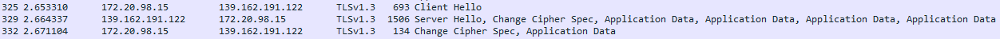

# Wireshark Sniffing

- [x] *TLS Wireshark Analyse*

*TLS ist auch dazu da, den Verkehr vor neugierigen Blicken zu verheimlichen. Doch zu Debugging-Zwecke wäre es oft hilfreich, den Traffic trotzdem mittels Wireshark mithören zu können. Und tatsächlich lässt sich dies bewerkstelligen, wenn man Einfluss auf eine der Seiten hat. Natürlich wollen Sie das durchführen und erforschen. Sie finden alles Wichtige dazu hier: https://wiki.wireshark.org/TLS Tipp: Sie müssen dem TLS Stream folgen. Und da lohnt es sich oft, den Hex Dump anzuzeigen. Insbesondere bei der Nutzung binärer Daten. Auch ein Blick ins Hex Dump Feld und dessen Reiter ist lohnend!*

[tls capture download](../tls.pcapng)

Wenn wir in dieser Datei nach `ssl` filtern, wird der Handshake klar ersichtlich.

**1. Client Hello**  
Mein Client initiiert den Verbindungsaufbau. Die Nachricht enthält Informationen wie die unterstützten Cipher Suites und ein Secret, welcher im Schlüsselaustausch verwendet wird.

**2. Server Hello**  
Diese Nachricht enthält die vom Server gewählte Verschlüsselungsmethode und eine weiteres Secret.

**3. Change Cipher Spec**  
Der Server teilt dem Client mit, dass die zukünftigen Nachrichten mit den neu ausgehandelten Verschlüsselungseinstellungen verschlüsselt werden.

**4. Application Data**  
Daten werden verschlüsselt ausgetauscht.

Man sieht auch, dass die Daten verschlüsselt wurden.

<https://wiki.wireshark.org/TLS>