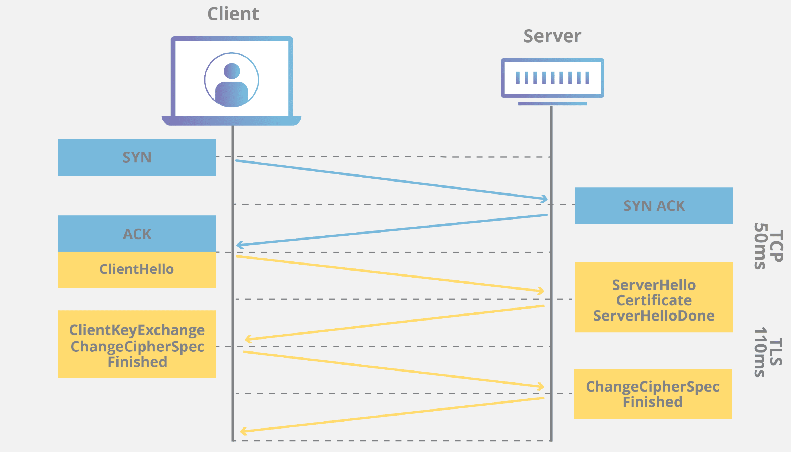

# Architektur des Protokolls
- [ ] *Verschaffen Sie sich einen Überblick über die Architektur des Protokolls.*

<https://www.cloudflare.com/learning/ssl/transport-layer-security-tls/>

There are three main components to what the TLS protocol accomplishes: Encryption, Authentication, and Integrity.

- Encryption: hides the data being transferred from third parties.
- Authentication: ensures that the parties exchanging information are who they claim to be.
- Integrity: verifies that the data has not been forged or tampered with.

  
[*Bild von Cloudflare*](https://cf-assets.www.cloudflare.com/slt3lc6tev37/5aYOr5erfyNBq20X5djTco/3c859532c91f25d961b2884bf521c1eb/tls-ssl-handshake.png)