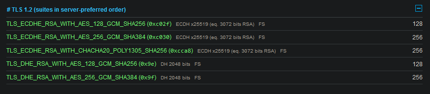
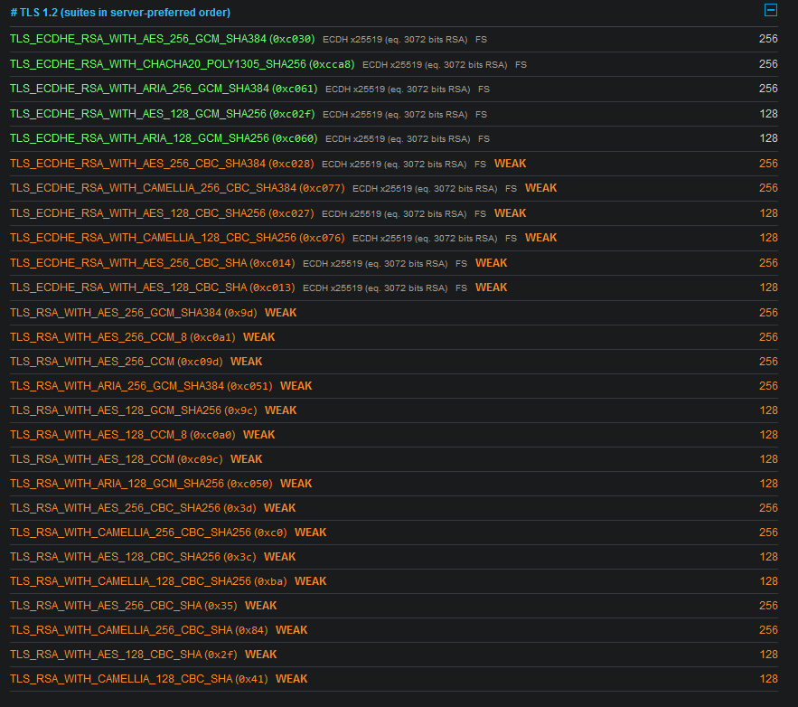

# Vergleich von verschiedenen HTTPS-Seiten
- [x] *Vergleichen Sie verschiedene HTTPS-Seiten (digitec, olat, Schweizer Bank Ihrer Wahl, Nischenbank z. B. garantibank.nl) auf ihren Sicherheitslevel.*

## Vergleich

Für jeden der folgenden Domänen habe ich den "SSL Server Test" von SSL Labs ausgeführt.  
[Wie funktioniert die Auswertung?](https://github.com/ssllabs/research/wiki/SSL-Server-Rating-Guide)

| **URL**| **Unterstützte TLS Versionen**| **SSL Labs Auswertung**|
|--|--|--|
| <https://www.digitec.ch>| 1.2 - 1.3| [A+](https://www.ssllabs.com/ssltest/analyze.html?d=www.digitec.ch)|
| <https://olat.bbw.ch>| 1.2 - 1.3| [A+](https://www.ssllabs.com/ssltest/analyze.html?d=olat.bbw.ch)|
| <https://garantibank.nl>| 1.2 - 1.3| [A+](https://www.ssllabs.com/ssltest/analyze.html?d=garantibank.nl)|
|--|--|--|
| <https://sephley.github.io/docs>| 1.2 - 1.3| [A](https://www.ssllabs.com/ssltest/analyze.html?d=sephley.github.io)|
| <https://www.sephley.com>| 1.2 - 1.3| [T (A wenn es trusted wäre)](https://www.ssllabs.com/ssltest/analyze.html?d=www.sephley.com)|

## Reflexion
Was bei meinen Webseiten zum A anstatt A+ geführt hat sind die Ciphers.  
Beispielsweise ist mir aufgefallen, das mein selbst-signiertes Zertifikat <https://www.sephley.com> schwächere Ciphers verwendet als <https://olat.bbw.ch>.

><https://olat.bbw.ch>  

><https://www.sephley.com>  
