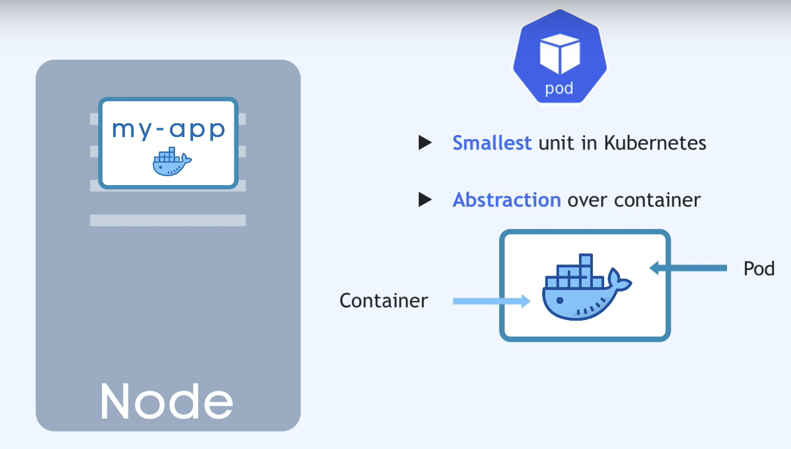
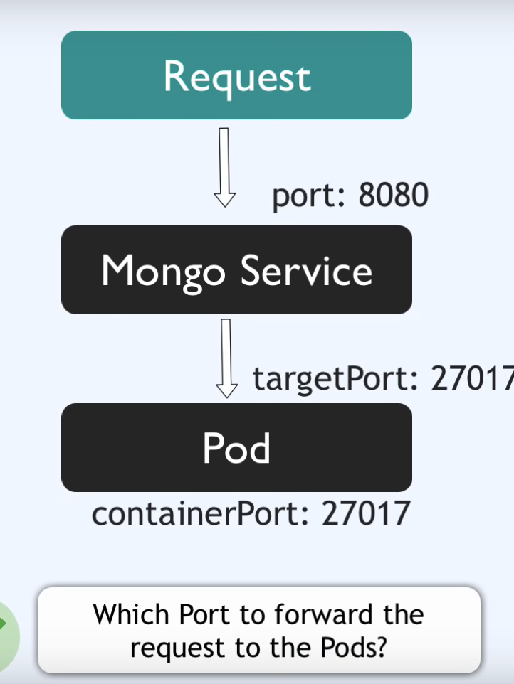
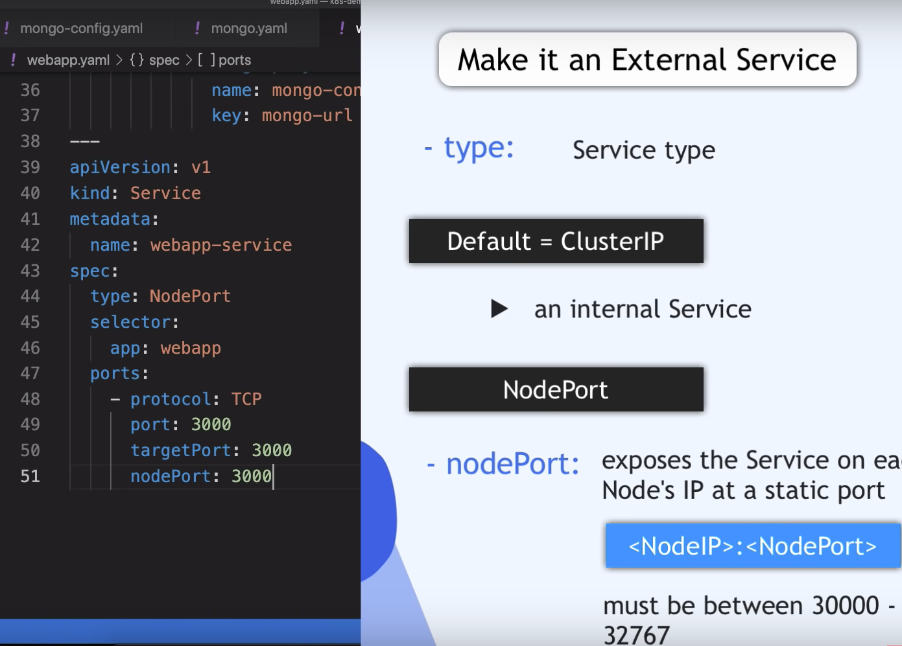

# ZLI Module 109
"Dienste in der Public Cloud betreiben und überwachen"
*Course:* <https://moodle.zli.ch/course/view.php?id=1610>

### Auftrag 1.1: Einfache HTML Seite erstellen und mit FTP «deployen»

### Auftrag 2.2: Git zur Sourcecode- und Konfigurationsverwaltung
<https://moodle.zli.ch/mod/h5pactivity/view.php?id=116428>  
<https://github.com/Sephley/Zli-m109>


Configure git username & email
```
git config --global user.name "user"

git config --global user.email "mail@mail.com"
```

### Auftrag 2.3: GitHub Einführung
<https://github.com/Sephley/Zli-m109>

### Auftrag 3.2:
```
sudo apt install -y apt-transport-https ca-certificates curl gnupg-agent software-properties-common
```
### Intallation minikube
Minikube can create a cluster containing only one node.

```
sudo apt install curl wget apt-transport-https -y  
wget https://storage.googleapis.com/minikube/releases/latest/minikube-linux-amd64  
sudo cp minikube-linux-amd64 /usr/local/bin/minikube  
sudo chmod +x /usr/local/bin/minikube  
curl -LO https://storage.googleapis.com/kubernetes-release/release/`curl -s https://storage.googleapis.com/kubernetes-release/release/stable.txt`/bin/linux/amd64/kubectl  
sudo mv kubectl /usr/local/bin/  
chmod +x kubectl  
minikube start --driver=docker  
minikube addons enable ingress  
minikube addons enable dashboard  
minikube addons enable metrics-server  
sudo reboot  
```

### Auftrag 4.2: Container Orchestration mit Docker Compose

see <https://docs.docker.com/compose/gettingstarted/> for how to set up a generic docker-compose application

see <https://github.com/Sephley/m109-site> for all the files

Docker-compose requires a docker-compose.yml file that can set up multiple Containers.  
Using ```docker compose up``` you start the containers

## Kubernetes
### Pod 
The Pod is the smallest unit in Kubernetes, usually only runs 1 Application.  
Each Pod gets its own IP address, not the container. They are rather ephemeral, which means they are prone to crash.



#### Service 
is used to attach an IP address to a pod, so that if it dies, the new one just uses the service to retain the IP address.  
It is possible to specify, whether the service is internal or external.

#### Ingress
Forwards IP-address of pod to domain name of application.

#### ConfigMap
Is the external Configuration of your application. Is only for non-confidential data! Unless you use secret to encrypt it.

### Volumes / Storage
Attaches a physical storage to a Pod, can be locally connected or also via Cloud.  
Think of it as an external drive plugged in to the kubernetes cluster.

### Deployment
A deployment is a template for creating pods.

### Kubernetes Configuration
deployments get sent to the API server.  
Each config file (written in yml) has 3 parts. The metadata, the specification and the third part defines the type of configuration (like service or deployment).  
Kubernetes always compares the desired state with the actual state and then does anything it can to reach the desired state if that is not the case.

### Minikube - Kubernetes ganz einfach
see <https://github.com/sephley/dev_minikube>  
also <https://kubernetes.io/docs/home/>

Note that the names 'mongo-config' or 'mongo-secret' do not need to be named this way. Kubernetes uses the 'name: ' key to differenciate between stuff.

#### mongo-config.yml
`mongo-config.yml` is the ConfigMap Configuration File. You should only create this once as you will reference it a lot.

#### mongo-secret.yml
`mongo-secret.yml` add your encode secrets (username and password) into this file.  
to encode you can run: `echo -n <word to encode> | base64`  
Once you have added these values they can be referenced by different deployments.

#### mongo.yml
`mongo.yml`  
the `spec` section of the file specifys the deployment specific stuff like type of webserver.  
the `template` section is like a whole new deployment with its own `spec` section etc. It configures the Pod within the deployment. You also set your docker image here.

`lables` are key/value pairs. They are for identifiying the "family" of the pods, so that for example two pods with the same label would have similar application running on them. Lables are required of Pods and are good practice for anythin else.  
You can call the labes whatever you want, it just has to be in key/value format like: "app: nginx" or "mykey: myvalue". "app:" is the standard key.

`selector` defines that all the pods that have label x belong to deployment y.

`replicas` defines how many pods you want to create with the deployment.

#### webapp.yml
`webapp.yml` is very similar to te `mongo.yml` file, as it is what runs the webservice based on the mongodb. The deployment is exactly the same, except for labels and the extra envirionment variable.

You can reference things from other files using `valueFrom`. This applies to all files.

`type: Nodeport` The nodePort is used to make the service available externally. Must be between 30000-32767.


#### Deployment

```
kubectl apply -f mongo-config.yaml  
kubectl apply -f mongo-secret.yaml  
kubectl apply -f mongo.yaml  
kubectl apply -f webapp.yaml
```

`kubectl get all` outputs all the components created in the cluster, whicht includes deployments, pods and all the services.

`kubectl get` can be used for everything in the cluster, like secrets, configmap, pods etc. Example: `kubectl get secret`

`kubectl --help` for help lol. You can also use the `--help` parameter for `kubectl get` more specific help.

`kubectl describe service webapp-service` to get info on your webapp deployment. Outputs stuff like IP, name, port etc. also works for pods: `kubectl describe pod mongo-deployment-564b4bdfdf-jx66n` you can see name of pod from `kubectl get` output.

`kubectl logs mongo-deployment-564b4bdfdf-jx66n` to see logs.

`minikube ip` to get IP. Now your application is accessible in your webbrowser. Remember to specify the external port (nodePort).